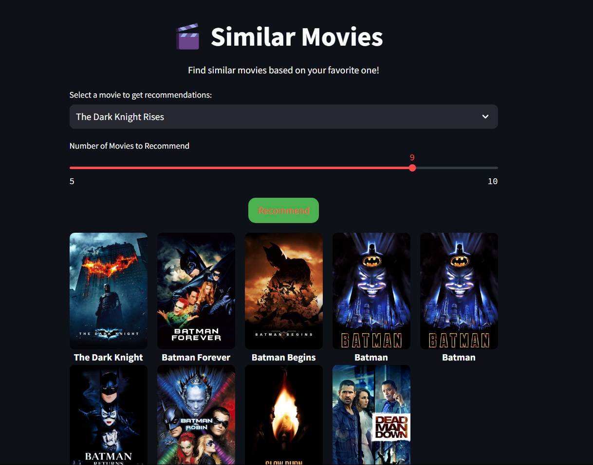

# Similar_Movies
Find Similar movies to your favourite movies.

## Usage
- Download tmdb_5000 dataset in folder.
- Install requirement.txt libraries/modules.
- Then run the run.ipynb file for generating movie list and necessary dependency for launching the Similar_Movies.
- Now on successful completion above steps we got two new files movie_dict.pkl and similarity.pkl which are fundamental for main.py .
- At last run the main.py file from below command.
  
  ```
  streamlit run main.py
  ```
  
- Your website will be launched locally.
- Now by using streamlit you can host your website publically also.


  
